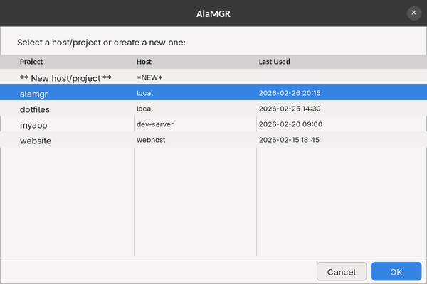

# AlaMGR

A GUI launcher for Alacritty project sessions. Each project gets its own Alacritty window running tmux with two vertical panes.



## Who This Is For

You SSH into multiple machines and juggle projects across them. You want one click to get back into the right host, the right directory, and the right tmux session — without remembering hostnames or retyping commands. If your workflow is "terminal on remote box, two panes, get to work," this is the launcher for that.

## Platform

**Linux only.** Requires a GTK desktop environment (X11 or Wayland). SSH host discovery reads `~/.ssh/config`.

## Features

- Pick from recent host/project pairs (sorted, with last-used timestamp)
- Browse existing projects on the target host
- SSH to remote hosts automatically; stays local for `local`
- Creates new project directories on the host if needed
- Names the tmux session `host-project` and reattaches if it already exists
- Window title: `project(hostshort)`
- Hosts populated from `~/.ssh/config` (wildcards and bare IPs skipped; configurable suffix stripped)

## How It Works

1. **Launch AlaMGR** — a zenity dialog opens showing recent host/project pairs.
2. **Select a pair** — choose an existing entry from history, or select `[NEW]` to pick a new host/project combination.
3. **Choose host** — if creating a new pair, pick a host from your `~/.ssh/config` (or `local` for the current machine).
4. **Choose project** — pick an existing project directory on that host, or enter a new name to create it.
5. **Alacritty opens** — a new Alacritty window connects to the host (via SSH if remote) and starts a tmux session with two vertical panes, `cd`'d into your project directory.

## Dependencies

- `alacritty`, `tmux`, `zenity`, `jq`, `bash`

## Install

```bash
./install.sh
```

Installs `alamgr` to `~/.local/bin/`, the `.desktop` entry, and the icon.

## Uninstall

```bash
./uninstall.sh
```

Removes `~/.local/bin/alamgr`, `~/.local/share/applications/alamgr.desktop`, and
`~/.local/share/icons/hicolor/256x256/apps/alamgr.png`, then refreshes icon and desktop caches.

## Configuration

Edit `~/.config/alamgr/env` (created by `install.sh` from `env.example`):

```bash
ALAMGR_DEV_ROOT="$HOME/dev"
ALAMGR_STRIP_SUFFIX=".mydom.local"
```

| Variable | Default | Description |
|---|---|---|
| `ALAMGR_DEV_ROOT` | `~/dev` | Root directory where projects are listed and created on each host. |
| `ALAMGR_STRIP_SUFFIX` | *(empty)* | Hostname suffix to strip from SSH config entries and window titles. |
| `ALAMGR_REMOTE_TMUX_OPTS` | mouse + clipboard settings | Newline-separated tmux commands applied when creating a new remote session. Set to empty string to disable. |

Environment variables still work and take precedence over the env file.

## History

Stored at `~/.config/alamgr/history.json`.
